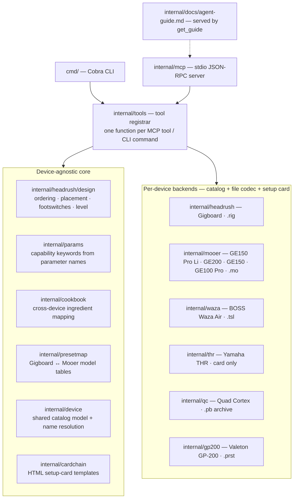
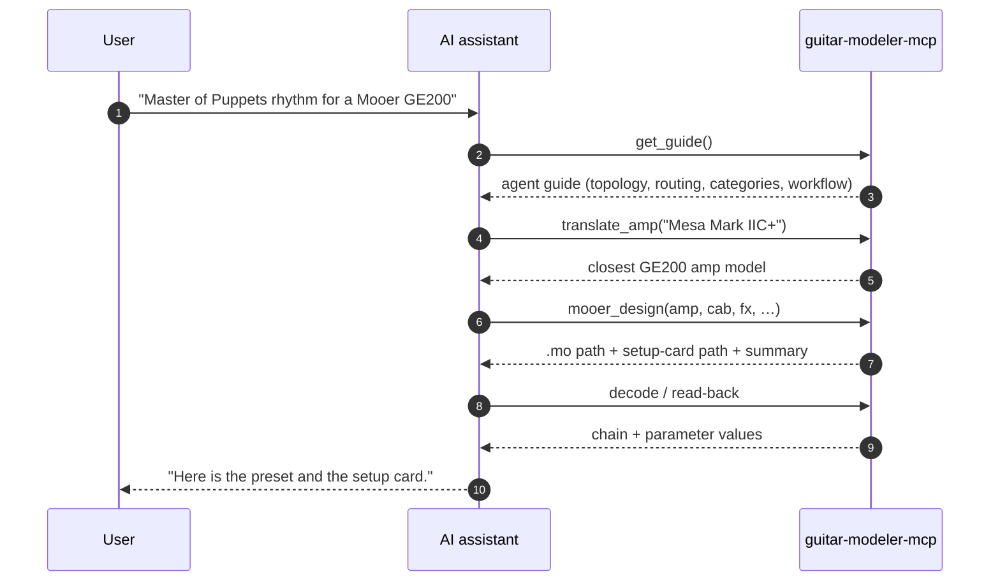

# guitar-modeler-mcp

## Disclaimer

> **!!! USE AT YOUR OWN RISK !!!** — This project writes preset files and set up instructions for
> third-party hardware. We do our best to get the formats right, but we can't
> guarantee compatibility with every device or firmware version. Well-meant
> contributions (fixes, corrections, new devices) are always welcome.

## In Short

> Tired of tweaking parameters by hand hoping to land a sound? This MCP gives
> AI assistants can do their best with the device catalogs and preset formats and set up the sound you seek.

**What it does:** designs guitar presets for real modelers — HeadRush Gigboard,
Mooer GE150 Pro / GE200 / GE100 Pro, BOSS Waza Air, Yamaha THR and Neural DSP
Quad Cortex. Describe a tone ("Master of Puppets rhythm for a Mooer GE200") and
it writes the device's preset file plus a printable setup card.

**How to use it:** download the binary, install it into your AI assistant, and
ask for a tone. No programming needed.

## Quick start

1. **Download** the binary for your computer:

   | Computer      | Download |
   | ------------- | -------- |
   | macOS (Intel & Apple Silicon) | [guitar-modeler-mcp-macos-universal.zip](https://nightly.link/d-led/guitar-modeler-mcp/workflows/ci/main/guitar-modeler-mcp-macos-universal.zip) |
   | Windows       | [guitar-modeler-mcp-windows-amd64.zip](https://nightly.link/d-led/guitar-modeler-mcp/workflows/ci/main/guitar-modeler-mcp-windows-amd64.zip) |
   | Linux (Intel/AMD) | [guitar-modeler-mcp-linux-amd64.zip](https://nightly.link/d-led/guitar-modeler-mcp/workflows/ci/main/guitar-modeler-mcp-linux-amd64.zip) |
   | Linux (ARM)   | [guitar-modeler-mcp-linux-arm64.zip](https://nightly.link/d-led/guitar-modeler-mcp/workflows/ci/main/guitar-modeler-mcp-linux-arm64.zip) |

2. **Unzip** it. On macOS/Linux make it runnable:

   ```sh
   chmod +x guitar-modeler-mcp
   ```

3. **Install it into your AI assistant** (one command):

   ```sh
   guitar-modeler-mcp mcp install            # VS Code / GitHub Copilot (global)
   guitar-modeler-mcp mcp install --target claude   # Claude Desktop
   ```

4. **Ask your assistant** for the tone you want, e.g.:

   > "Create a Master of Puppets rhythm preset for my Mooer GE200."

   The assistant drives the tools and hands you the device's preset file plus a
   printable setup card.

That's it. The rest of this document lists the supported hardware and the
finer details (CLI, tool list, architecture) for anyone who wants them.

## Supported hardware

### Modelers & amps

| Device | Models | Preset exchange | Extra output |
|---|---|---|---|
| HeadRush Gigboard | — | `.rig` (read & write) | HTML report |
| Mooer | GE150 Pro Li, GE200, GE100 Pro | `.mo` (read & write, each model's own layout) | printable setup card |
| Mooer GE150 | GE150 | — | card only (no `.mo` for this model) |
| BOSS Waza Air | — | `.tsl` (read & write) | printable setup card |
| Yamaha THR | THR-II, THR10, THR10C, THR10X | — | card only |
| Neural DSP Quad Cortex | — | — (see [Quad Cortex](quad-cortex.md)) | setup card + `.pb` reference archive |

### Accessories

| Accessory | Works with | Modelled as |
|---|---|---|
| XSONIC AIRSTEP BW Edition | BOSS Waza Air | 4 footswitch modes (channel memories CH 1–6 + BOOSTER/MOD/FX/DELAY/REVERB toggles), printable on the setup card |

## Trademarks & disclaimer

All trademarks, logos and brand names are the property of their respective
owners. All company, product and service names used in this project are for
identification purposes only; use of these names, trademarks and brands does not
imply endorsement. This project is not affiliated with, endorsed by, or
sponsored by HeadRush or any of the referenced brands.

## Features

Designs and writes presets for the HeadRush Gigboard (`.rig` read/write,
parallel routing, footswitch scenes, setlists), Mooer GE150 Pro Li / GE200 /
GE100 Pro (`.mo` read/write in each device's own layout, plus a setup card; the
classic GE150 is card-only),
BOSS Waza Air (`.tsl` read/write, setup card, XSONIC AIRSTEP BW footswitch
modes), Yamaha THR (setup cards) and Neural DSP Quad Cortex (catalog,
translation, per-model parameters, a setup card plus a `.pb` reference archive,
and `qcctl` live USB). See [Quad Cortex](quad-cortex.md) for exactly what the
Quad Cortex workflow can and cannot do; planned work lives in
[roadmap.md](roadmap.md).

## Workflow

Give it a song and a tone description, and it will:

1. translate real-world hardware (amps, cabs, mics) into the models the device
   emulates,
2. order the effects into a musically sensible signal chain,
3. write the device's preset file (`.rig` / `.mo` / `.tsl`) or, for the Quad
   Cortex, a setup card plus a `.pb` reference archive — the `.pb` is not a
   file the unit imports,
4. produce a human-readable HTML page of the settings used,
5. decode an existing preset so an agent can analyze or fix it.

## How it works

The design core (translation, effect ordering, hardware-control assignment,
level estimation, report rendering, the agent workflow) is device-agnostic. A
per-device backend supplies the model catalog and preset file format:

- **Gigboard backend** — `internal/headrush/catalog` (amps/cabs/mics/FX + the
  translation layer from [Gigboard Hints](https://boguz.github.io/gigboardhints/)),
  `internal/headrush/rig` (the exact on-disk `.rig` format: outer JSON envelope
  whose `content` field is a second JSON document describing the signal chain),
  `internal/headrush/modspec` (parameter ranges/enums extracted from the
  editor), `internal/headrush/design` (effect ordering + placement),
  `internal/headrush/htmlreport` (report rendering) and
  `internal/headrush/setlist` (`.setlist` files).
- **Mooer backend** — `internal/mooer` (per-model catalogs, the `.mo` format
  and setup cards) and `internal/presetmap` (Gigboard ↔ Mooer model mapping).
- **Waza Air backend** — `internal/waza` (amp/effect catalogs, the BOSS TONE
  STUDIO `.tsl` backup format and setup cards).
- **THR backend** — `internal/thr` (amp/effect catalogs and setup cards; the
  THR has no preset file format, so the card is the only output).
- **Quad Cortex backend** — `internal/qc` (catalogs, the `.pb` reference
  archive, decode and setup cards) and `internal/qcctl` (live USB via the
  external `qcctl` helper).
- **GP-200 backend** — `internal/gp200` (catalogs, the `.prst` preset file and
  setup cards).
- Shared pieces: `internal/device` (catalog model + name resolution),
  `internal/params` (capability keywords derived from parameter names),
  `internal/cookbook` (cross-device ingredient mapping),
  `internal/cardchain` (HTML setup-card templates) and
  `internal/headrush/assets/data/blocks` (factory block definitions captured
  from the device backup, used as defaults for every effect module).
- `internal/docs/agent-guide.md` — the agent-facing guide (signal-chain topology,
  parallel routing constraints, effect categories, workflow). It is embedded in
  the binary and exposed to agents through the `get_guide` MCP tool.

## Architecture

### Components



### Data flow

```mermaid
flowchart LR
    A["tone description<br/>Master of Puppets rhythm for a GE200"] --> B
    B["translate · search · catalog_list_*<br/>real hardware → device models"] --> C
    C["design · design_rig · mooer_design · qc_design …"] --> D
    D["order effects · place pre/post amp"] --> E
    E["validate every parameter<br/>name · range · enum · unit"] --> F
    F["estimate output level<br/>per block · per parallel path"] --> G
    G["write preset file<br/>.rig · .mo · .tsl · .prst · .pb"] --> H
    H["render HTML report / setup card"] --> I
    I["decode · rig_decode · qc_decode_preset<br/>verify against the device format"] -->|"tweak"| C
```



### Agent workflow



## Build

```sh
go build -o guitar-modeler-mcp .
go test ./...
```

Requires Go 1.27+.

## Releases

Binaries are built with [GoReleaser](https://goreleaser.com) and published as
GitHub release artifacts when a `v*.*.*` tag is pushed (Linux `amd64`/`arm64`,
Windows `amd64`, macOS universal). Nightly "latest" builds are linked from
[Quick start](#quick-start) above.

To publish a release:

```sh
git tag v1.0.0
git push origin v1.0.0   # goreleaser publishes the release
```

## CLI

The CLI mirrors the MCP tools. Everything except `map` and `device` targets the
**HeadRush Gigboard** — `catalog`, `translate`, `search`, `fx-placement`,
`design`, `report`, `decode`, `diff`, `level`, `setlist`. `map` converts a
preset between the Gigboard and a Mooer; `device list` shows every supported
device. The other devices (Mooer, Waza Air, THR, Quad Cortex, GP-200) are
reached through the MCP tools. A few representative calls:

```sh
# Translate real hardware into a Gigboard model
guitar-modeler-mcp translate amp "Marshall JCM800"

# Search the Gigboard catalog
guitar-modeler-mcp search "tube screamer" --kind fx

# Dial in a tone and write the .rig + HTML report
guitar-modeler-mcp design --name "Brown Sound" --amp "Marshall JCM800" --out ./rigs

# Decode / diff / estimate an existing .rig
guitar-modeler-mcp decode "001 HOW DOES IT FEEL.rig"
guitar-modeler-mcp diff BEFORE.rig AFTER.rig
guitar-modeler-mcp level "001 HOW DOES IT FEEL.rig"

# Install the MCP server in a client
guitar-modeler-mcp mcp install
```

The complete `--help` output for every command is in [cli.md](cli.md),
regenerated with `bash scripts/gen-cli-help.sh`.

## MCP server

Run over stdio:

```sh
guitar-modeler-mcp serve
```

`mcp install` writes the registration for you. The equivalent manual
`.vscode/mcp.json` entry is:

```json
{
  "servers": {
    "guitar-modeler-mcp": {
      "type": "stdio",
      "command": "/absolute/path/to/guitar-modeler-mcp",
      "args": ["serve"]
    }
  }
}
```

### Tools

| Tool | Purpose |
| --- | --- |
| `get_guide` | Return the embedded agent guide (chain topology, routing constraints, categories, workflow) |
| `get_fx_placement` | Where each effect category goes (pre/post amp) and the slot budget per chain layout |
| `search_catalog` | Fuzzy-search amps/cabs/mics/effects by name or the real hardware they emulate (both directions) |
| `catalog_list_amps` | List amps with the real hardware each emulates (`modeled_after`), a `gain` character (clean/edge of breakup/crunch/high gain/bass) and capabilities |
| `catalog_list_cabs` | List cabinet models |
| `catalog_list_mics` | List microphone models |
| `catalog_list_fx` | List all effect modules with capabilities |
| `catalog_list_fx_categories` | List effect categories (distortion, dynamics, eq, expression, modulation, delay, reverb, utility) |
| `catalog_list_fx_by_category` | List effect modules in one category (e.g. `delay`, `reverb`) |
| `catalog_list_block_presets` | List factory presets for one effect |
| `catalog_list_module_params` | Describe a module's parameters (kind, range, unit, options) |
| `translate_amp` / `translate_cab` / `translate_mic` | Hardware → device model |
| `design_rig` | Translate, order, write `.rig` + HTML report (serial or parallel chain); assign the 4 stomp switches with `footswitches` (toggle or scene) |
| `create_setlist` | Bind several `.rig` files into a device `.setlist` for songs that need multiple chains |
| `render_report` | HTML report for an existing `.rig` |
| `rig_decode` | Decode a `.rig` into chain + mixer (levels/pans/delay) + parameter values |
| `estimate_rig_level` | Estimate a rig's output level and recommend a RigVolume for a target level |
| `device_list` | List every supported device and whether it exchanges preset files |
| `mooer_catalog_list_amps` / `_cabs` / `_fx` | List a Mooer model's amps, cabs and effects (with the real hardware each emulates) |
| `mooer_design` | Build a Mooer preset: writes `.mo` (file-capable models) + a printable setup card |
| `mooer_design_bank` | Design a song's variations into one bank (2–4 presets, one per position) on devices that address presets as `01A`/`01B`/… |
| `render_setup_card` | Render a setup card from an existing `.mo` |
| `map_preset` | Convert a preset across devices: Gigboard `.rig` ↔ Mooer `.mo` |
| `map_ingredients` | Port a preset's blocks to another modeler by matching feature tags; returns a mapping table with per-block knob links and coverage % |
| `waza_catalog_list_amps` / `_fx` | List the Waza Air's amps and effects (with the real hardware each emulates) |
| `waza_write_tsl` | Write a BOSS TONE STUDIO `.tsl` liveset for the Waza Air from a tone description |
| `waza_read_tsl` | Read a Waza Air `.tsl` and report the first patch's tone |
| `waza_setup_card` | Write a printable HTML setup card for a Waza Air tone |
| `waza_catalog_list_modes` | List the four AIRSTEP BW footswitch modes (channel memories + effect toggles) |
| `thr_catalog_list_amps` / `_fx` | List a Yamaha THR model's amp-selector positions (type × mode) and its effects/cabinets |
| `thr_setup_card` | Write a printable HTML setup card for a Yamaha THR tone (the THR has no preset file format, so the card is the only output) |
| `gp200_catalog_list_amps` / `_cabs` / `_fx` | List the Valeton GP-200 amps, cabs and effects (with the real hardware each is based on) |
| `gp200_list_model_params` | Describe one GP-200 model's parameters (name, kind, range/step or options, default) |
| `gp200_design` | Build a GP-200 patch across its 11 fixed-function blocks and write a `.prst` preset file |
| `gp200_read_prst` | Decode a GP-200 `.prst` and report each block's effect model and parameter values |
| `gp200_setup_card` | Render a printable setup card from an existing GP-200 `.prst` |
| `qc_catalog_list_amps` / `_cabs` / `_fx` | List the Quad Cortex amps, cabs and effects (with wire ids and the real hardware each is based on) |
| `qc_translate_amp` / `qc_translate_cab` | Real hardware → the exact Quad Cortex model |
| `qc_list_model_params` | Describe one Quad Cortex model's parameters (min/max/default/steps, so values are set on the screen's own line) |
| `qc_design` | Build a serial Quad Cortex preset and write a self-contained HTML setup card + a `.pb` reference archive |
| `qc_decode_preset` | Decrypt and decode a `.pb` reference archive into a readable summary |
| `qc_render_setup_card` | Re-render the HTML setup card from a `.pb` reference archive |
| `qc_usb` | Live USB control by shelling out to `qcctl` (pyquadcortex): read the firmware version, recall a slot already on the unit, switch scenes, dump a slot's preset — after the user confirms |

Example agent workflow: list amps → translate the song's amp → `design_rig` with
effects → read the report → tweak by re-running `design_rig` with parameter
overrides or by decoding and fixing an existing file.

Every tool call is logged to stderr as `mcp: tool called: <name>` — the name
only, never the arguments — so you can see at a glance whether and when the MCP
is being used.

## Signal chain & parallel routing

The full agent-facing guide lives in `internal/docs/agent-guide.md` and is
embedded in the binary — agents read it via the `get_guide` tool. In short, the
Gigboard's 11 chain slots can split into **two parallel paths**; the `Routing`
field takes exactly three values across the 293 device backups:

| `Routing` | Topology | Slot layout (1–11) |
| --- | --- | --- |
| `S` | Serial | 11 slots, one path |
| `SPS-1` | Serial → parallel → serial | 3 shared → path A (3) + path B (3) → 2 shared |
| `PS-1` | Parallel from the input → serial | path A (3) → path B (4–5) → shared remainder |

Key constraints: **`SPS-1`** has fixed split/merge points (3 shared slots,
3+3 parallel, 2 shared); a second amp is just another `Amp` module (`Amp` vs
`Amp 2`, same model = same amp on both channels); a single `Amp` in the shared
prefix feeds both paths (wet/dry/wet). Each section has a hard slot budget the
builder enforces. In `design_rig` pass `routing`, `amp2`, `cab2`, `mic2`,
`path_a_fx`, `path_b_fx` (CLI: `--routing`, `--amp2`, …).

### Footswitches

The four stomp switches (FS5–FS8) can each turn a module on/off. Assign them
with `design_rig`'s `footswitches` argument (CLI: `--footswitches`), an ordered
list of up to four `{"module": "...", "operation": "On"}` entries mapped to
FS5, FS6, FS7 and FS8. `module` is the module **instance name** exactly as it
appears in the chain (`Wham`, `Green JRC-OD`, `Amp 2`); `operation` defaults to
`"On"` (toggle on/off). A module not in the chain — or a fifth switch — is
rejected.

A **Scene** switch (`"mode": "scene"`) recalls a multi-block on/off snapshot in
one press: give it a `label` and list the blocks the scene turns `on` and `off`
(blocks not listed keep their current state):

```sh
guitar-modeler-mcp design --name "Always" --amp "67 Black Duo" \
  --fx '[{"type":"S1 Drive"},{"type":"Green JRC-OD"},{"type":"BBD Delay"}]' \
  --footswitches '[
    {"module":"Green JRC-OD","mode":"scene","label":"DRIVE",
     "scene":{"on":["S1 Drive","Green JRC-OD"],"off":["BBD Delay"]}},
    {"module":"BBD Delay","mode":"scene","label":"CLEAN",
     "scene":{"on":["BBD Delay"],"off":["S1 Drive","Green JRC-OD"]}}]'
```

The scene writes each slot's state directly into the `.rig` (0 = no change,
1 = on, 2 = off), matching what the device's own scene editor produces.

### Songs with multiple sounds (Gigboard)

Setlists are a **Gigboard-only** feature — the other devices have no setlist
file format. On the Gigboard, one song with incompatible chains (e.g. clean,
drive, solo) is best handled as **several rigs bound into a setlist** — design
each rig, then bind them:

```sh
guitar-modeler-mcp design --name "Song Clean" --amp "65 Black SR" --out <card>/Rigs
guitar-modeler-mcp design --name "Song Drive" --amp "68 Plexiglas 50W" --out <card>/Rigs
guitar-modeler-mcp setlist --name "Song" --out <card>/Setlists <card>/Rigs/*.rig
```

Copy `Rigs/` and `Setlists/` onto the Gigboard's SD card and the whole song
travels as one bank. Scenes (one rig, blocks toggled) suit variations of the
*same* chain; setlists suit chains that must be rebuilt. On the Mooer devices
that file presets as bank + position — the GE100 Pro (50 banks of 3, `01A`–`50C`)
and the GE150 Pro Li / GE150 Max (50 banks of 4, `01A`–`50D`) — the footswitches
step through a bank, so `mooer_design_bank` designs the song's variations into
one; on the GE200 and the classic GE150, keep the song's sounds as separate
presets.

The builder **validates every parameter** against the device's specifications
(extracted from `headrush-desktop/renderer/config/modules/*.ts` plus the
backup-derived catalog): unknown parameter names, out-of-range numbers and
invalid enum options are rejected with a clear message, so an invalid `.rig` is
never written. On top of that, a **plausibility check** refuses to write a rig
whose estimated output level would be very loud (> +20 dB) or effectively muted
(amp master 0%), pointing out the offending level and how to fix it; `output
level`, `input gain` and `cab out gain` are all range-capped. Regenerate the
extracted spec with
`node scripts/extract-module-config.cjs <headrush-desktop-root> internal/modspec/data/params.json`,
and the hints data with
`node scripts/extract-hints.cjs <gigboardhints-root> internal/catalog/data/hints.json`.

## Data provenance

Amp/cab/mic model lists come from the device backup and the community-maintained
[Gigboard Hints](https://boguz.github.io/gigboardhints/) translation table.
Where the emulated amplifier is not publicly documented, the brand is left empty
rather than guessed.

## Adding a device line

The recipe for supporting another modeler — or another model in an existing
line — is the same everywhere. A new backend reuses the device-agnostic core
(translation, effect ordering, capability search, setup-card shell) and only
supplies its own catalog, file format and card. Roughly, in order:

1. **Catalog** — enumerate the device's amps, cabs, mics and effects with the
   real hardware each emulates (`inspired_by`). Where the emulation is
   undocumented, leave the brand empty rather than guess.
2. **Parameter spec** — for every model, the knob list with its **unit and
   range on the device's own screen** (e.g. GP-200 `Rate` is 0.1–10 Hz; a
   Mooer GE100 Pro EQ band is −16…+16 dB wired as 0…32 with 16 = flat). Kind
   (knob / switch / combo), min/max/step, enum options and default.
3. **File codec** — read and write the device's preset format (`.rig`, `.mo`,
   `.tsl`, `.prst`, …). For read-only or card-only devices, produce the setup
   card only (see the classic GE150 and the THR).
4. **Translation + search** — register the catalog in the fuzzy search and the
   translate tools so "JCM800" finds "82 Lead 800 100W" in both directions.
5. **Capabilities** — add any new parameter names to `internal/params` so
   capability search (`pitch shift`, `reverb`, …) keeps working.
6. **Cross-device mapping** — add the model's blocks to `internal/cookbook`
   (ingredient tags) and, where a shared "inspired by" table exists,
   `internal/presetmap`, so `map_ingredients` / `map_preset` cover it.
7. **Setup card / report** — a template under the backend plus the shared
   `internal/cardchain` HTML shell.
8. **Wire-up** — one MCP tool per capability (list / translate / design /
   decode) in `internal/tools`, one CLI subcommand in `cmd/`, and a
   `device_list` entry that says whether the device exchanges preset files.
9. **Validation & guards** — the builder must reject unknown parameter names,
   out-of-range values and invalid enums, and never write a file the device
   can't parse. Keep the plausibility guard (never write a muted or
   ear-splitting preset) for any device with a level model.
10. **Tests** — round-trip the file codec, golden-snapshot the catalog and the
    exact bytes written, and exercise one end-to-end `design → decode → card`
    trip through the MCP server.
11. **Docs** — update this README's hardware table,
    `internal/docs/agent-guide.md` (the single source of agent-facing
    knowledge) and [roadmap.md](roadmap.md).

## Testing

```sh
go test ./...             # unit + approval + integration tests
go test -race ./...       # with the race detector
UPDATE_GOLDEN=1 go test ./...   # regenerate approval snapshots after a change
```

- **Unit tests** cover the translation layer, rig builder (round-trip,
  validation, parameter overrides), design ordering, and config install logic.
- **Approval tests** (`internal/golden`) snapshot the full catalog, the exact
  `.rig` JSON the builder emits, and the HTML report, so any change to the
  device format or model data is caught by a diff.
- **Integration tests** (`internal/tools/integration_test.go`) drive the real
  MCP server over the JSON-RPC stdio transport: initialize, tools/list, and a
  full `design_rig` → `rig_decode` → `render_report` round trip.
